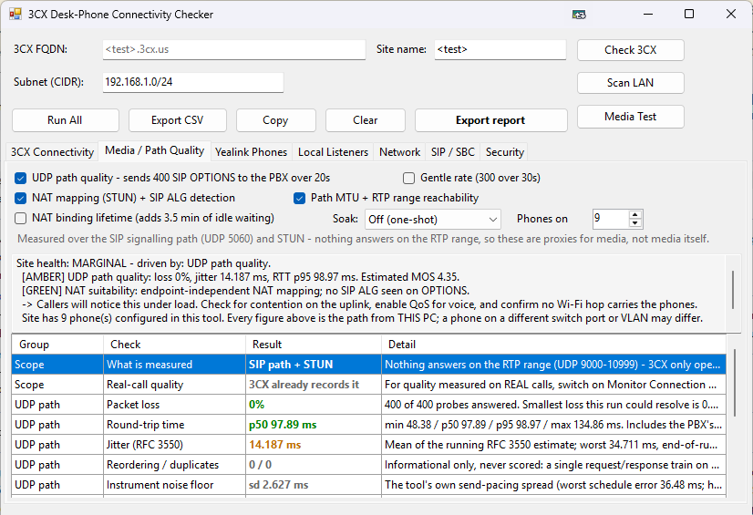

# 3CX Desk-Phone Checker

A WinForms tool for **Windows PowerShell 5.1** for the site where the desk phones say "No Service", calls drop or audio goes one way. Run it on a PC at the site and it checks the things that are hard to see from the 3CX console: whether the phones' ports and certificates work from *this* network, how the UDP path to the PBX really behaves, what the router does to SIP, which Yealink phones are on the LAN, and whether there's a local SBC or Router Phone carrying them.

From [ihavenoram.com](https://ihavenoram.com): field notes for ADHD techs running managed services.



## Download

Grab the latest zip from **[Releases](../../releases/latest)**. The SHA-256 checksum is in the release notes and in the `.sha256` file beside the zip:

```powershell
Get-FileHash .\3CX-Checker.zip -Algorithm SHA256
```

## Run it

Copy the folder to the PC (the files must stay together) and double-click **`Launch-3CX-Checker.cmd`**. It starts PowerShell with `-STA`, which WinForms needs. No admin rights are needed for the network tests, and it works from a ScreenConnect Backstage session.

Type the PBX's name into the FQDN box (it opens as `<test>.3cx.us`, and clicking selects `<test>`), check the subnet, then click **Run All**.

## What it checks

| Tab | What you get |
|---|---|
| **3CX Connectivity** | TCP 443 / 5001 / 5060 / 5061 / 5090, a real **SIP OPTIONS over UDP** (a TCP connect to 5060 proves nothing about the phones' path), and a TLS check the way a phone does it, including a server that doesn't send its intermediate certificate. Also the site's public IP. |
| **Media / Path Quality** | Loss, jitter and round trip from a paced train of SIP OPTIONS, NAT mapping behaviour (STUN), SIP ALG detection, path MTU, positive-only RTP range reachability, and an optional soak. One Green / Amber / Red site health, taken from the worst measured result. |
| **Yealink Phones** | Every Yealink on the LAN with its model, no login needed. Type a phone's password into its row to read firmware, SIP server, registration and **where it provisions from** (a phone still provisioning from an old PBX reverts at its next reboot). Covers T5x firmware's encrypted web login. |
| **Local Listeners** | Anything on this PC holding TCP or UDP 5001 / 5060 / 5061 / 5090. |
| **Network** | Which device is the gateway and DHCP server, and whether a phone has ended up doing either. |
| **SIP / SBC** | Finds the site's 3CX SBC or Router Phone (Raspberry Pi, Linux, Windows), says which PBX it forwards to, checks a Windows SBC on this PC (service, tunnel, log), and has SSH plus verified commands for a Linux SBC. |
| **Security** | This PC's SBC exposure, an imported 3CX event log (tunnel outages and why they happened, scanner and toll-fraud probes, brute-force lockouts) and a pasted IP blacklist checked against the site's real public IP. |

**Export report** saves a JSON report, and `Generate-3cxReport.ps1` turns it into a self-contained HTML site report with a hardening checklist. **Export CSV** and **Copy** are there for quick notes.

The full reference, including every check's known limits, is in [docs/TECHNICAL.md](docs/TECHNICAL.md).

## It says what it can't measure

Nothing answers on 3CX's RTP range outside a call, so the media figures are measured over the SIP signalling path and labelled as a proxy on every row. The MOS is an estimate and is refused below 100 replies. A silent RTP port proves nothing, so that test is positive-only. "Not measured" is a state of its own, and the tool never fills a gap with a guess.

## Safe to run on a live site

- **It's read-only.** It never writes to the PBX, the phones or the SBC. The only exceptions are the SBC restart / stop / re-provision commands, which you have to choose yourself and confirm first.
- **Rate limits are enforced in code**: at most 50 packets per second and 600 per run to the PBX, and a 60-second cooldown, so a path test can't trip 3CX's anti-hacking and take the site's SIP down.
- **A phone gets a login attempt only with the password you typed against it.** Nothing is guessed, and a phone whose web login is locked isn't tried again.
- Passwords are held for the session only. They never reach the log, an export or the report, and neither does the SBC's tunnel password or provisioning link.

## Files

| File | Purpose |
|---|---|
| `Launch-3CX-Checker.cmd` | Launcher (forces `-STA`) |
| `3CX-Checker.ps1` | The GUI and background worker |
| `3CX-Checker.Helpers.ps1` | Every network test, shared by the GUI and the worker |
| `Generate-3cxReport.ps1` | Turns an exported JSON report into an HTML site report |
| `docs/TECHNICAL.md` | The full reference |

## Notes

- Windows PowerShell 5.1 only. Optional: PuTTY's `plink` (0.77+, and only if validly signed) for capturing SSH command output. Windows' own `ssh.exe` covers the terminal.
- Everything the tool writes describes a real site, so it all lands in `Output\` and the included `.gitignore` keeps it out of repositories.
- Not affiliated with or endorsed by 3CX or Yealink. The names are used only to say what the tool works with.

## About

Built with AI assistance (Claude) for real MSP work on 3CX sites. It's provided as is, with no warranty. The LAN scan and SIP sweep send real traffic, so check how your EDR and your customers' monitoring will react before running it.

MIT licensed; see [LICENSE](LICENSE).
